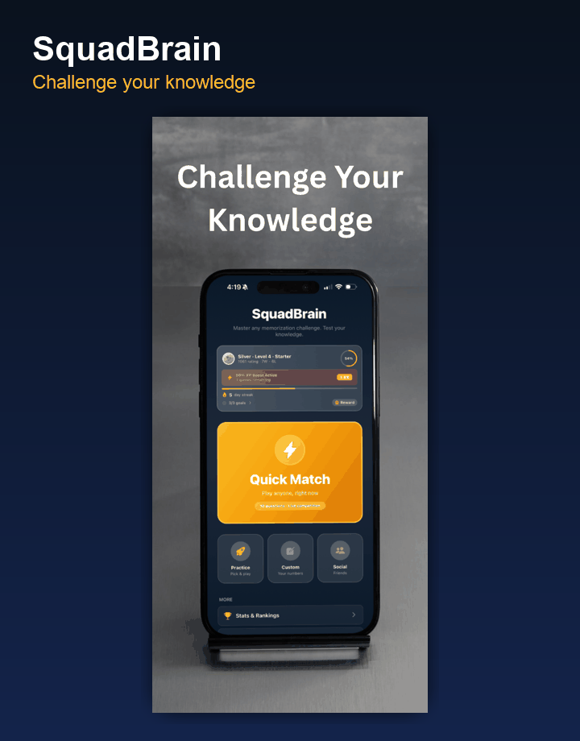
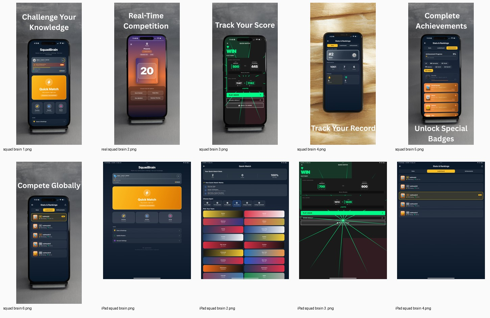
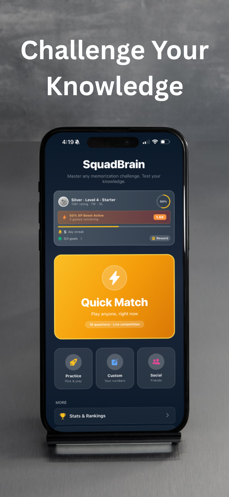
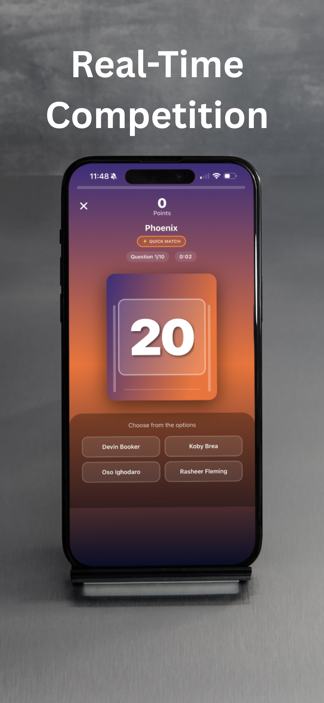
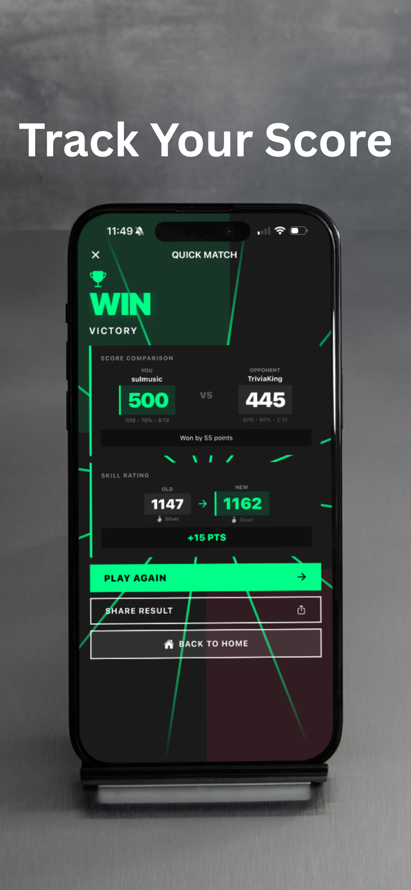
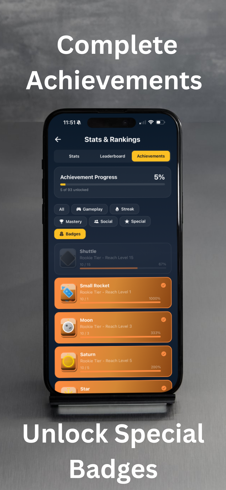
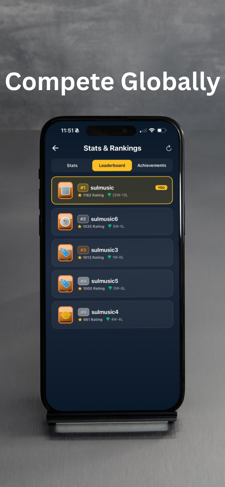

# SquadBrain — Sports Roster Memorization Game

[](https://github.com/sulmusic2-star/squadbrain-showcase/actions/workflows/ci.yml)


> A mobile sports-learning game built around roster memory, quick-match competition, achievement loops, and cross-device progression.

SquadBrain turns roster knowledge into a repeatable game loop: pick a team, practice recall, play quick rounds, compete on results, and come back through streaks, achievements, rank movement, and friend challenges.





Live demo: https://sulmusic2-star.github.io/squadbrain-showcase/

## What the product does

Most sports trivia games test facts after the fact. SquadBrain focuses on learning the roster itself:

1. pick a sport and team
2. memorize jersey numbers, players, positions, and roster patterns
3. play quick rounds to reinforce recall
4. compete through quick-match and leaderboard mechanics
5. return through streaks, achievements, rank progression, and friend challenges

## What this build shows

- Mobile product design and iteration
- Expo / React Native app architecture
- TypeScript-based product surfaces
- State management across game, user, progress, achievements, monetization, and matchmaking flows
- Firebase-backed social and leaderboard concepts
- Cloud Functions patterns for validation-sensitive actions
- ELO-style competitive ranking and quick-match flows
- Multi-sport roster data modeling
- Responsive iPhone/iPad layouts
- App Store packaging, legal screens, screenshots, and release-readiness thinking

## Product surface

The app includes surfaces for:

- onboarding and username setup
- sport and team selection
- practice mode
- quick match
- results and ELO movement
- global leaderboard
- achievement badges
- friend flows and challenges
- progress tracking
- store / monetization experiments
- legal / privacy screens

See [`docs/product-tour.md`](docs/product-tour.md).

## Technical architecture

High-level stack:

- **Frontend:** Expo + React Native + TypeScript
- **State:** Zustand stores with persisted local state
- **Backend:** Firebase Auth, Firestore, Cloud Functions
- **Game logic:** local game loop with server-side result validation patterns
- **Competition:** quick match, ELO movement, leaderboards, achievements
- **Release:** App Store-oriented metadata, legal pages, screenshot pack, mobile/iPad layouts

See [`docs/architecture.md`](docs/architecture.md), [`docs/engineering-decisions.md`](docs/engineering-decisions.md), and [`docs/testing.md`](docs/testing.md).


## Code examples

Small TypeScript examples show the product logic behind gameplay, ranking, and achievements:

- [`examples/game-session-state.ts`](examples/game-session-state.ts)
- [`examples/ranking.ts`](examples/ranking.ts)
- [`examples/achievement-engine.ts`](examples/achievement-engine.ts)
- [`examples/roster-normalization.ts`](examples/roster-normalization.ts)
- [`examples/matchmaking.ts`](examples/matchmaking.ts)
- [`docs/coverage-summary.md`](docs/coverage-summary.md)

## Run the code examples

```bash
npm ci
npm run ci
```

The CI command type-checks the examples, runs unit tests for ranking, achievements, session state, roster normalization, and matchmaking, and produces a coverage report.

## Screenshots

| Home / quick match | Competition | Result / ELO |
|---|---|---|
|  |  |  |

| Record | Achievements | Leaderboard |
|---|---|---|
|  |  |  |

## Technical decisions

- Local state keeps gameplay fast instead of making every tap depend on the network.
- Cloud-backed profile, leaderboard, and social records support continuity across devices.
- Server-side validation patterns protect competitive results.
- Same-team matching keeps comparisons fair.
- Achievements, streaks, and rank movement make memorization feel like progression instead of homework.
