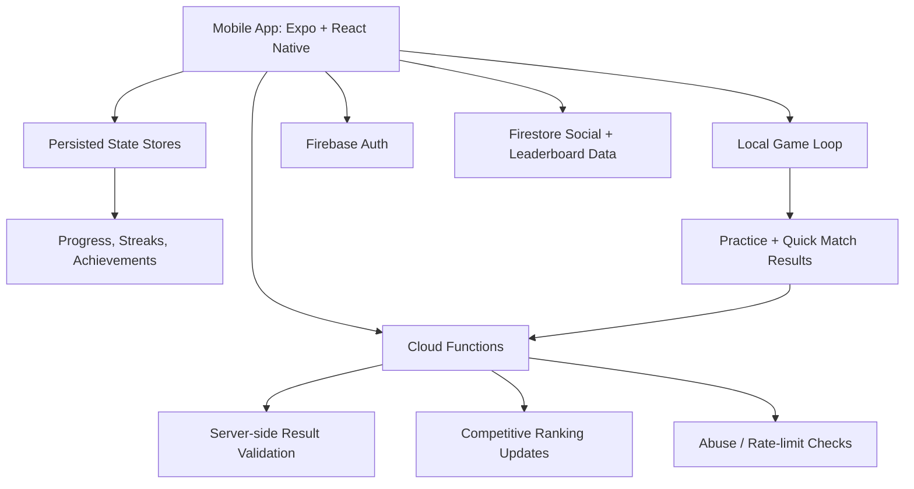

# Architecture Overview

This is a high-level architecture summary. It is intentionally redacted so the public repo demonstrates competence without exposing private implementation details.

## Frontend

The private app uses an Expo / React Native / TypeScript frontend with screen-level flows for onboarding, sport selection, gameplay, results, leaderboards, friends, achievements, and store surfaces.

## State model

State is split by concern:

- user identity and profile state
- game session state
- scores and history
- achievements and XP/progression
- matchmaking and competitive stats
- social/friend/challenge state
- monetization state
- theme/responsive helpers

This separation keeps game interactions fast and avoids making every gameplay action depend on the network.

## Backend model

The private implementation uses Firebase services for identity and cloud persistence, with server-side functions for validation-sensitive operations.

Publicly shareable backend concepts:

- challenge records for competitive play
- leaderboard records for rank/progression surfaces
- user profile records for cross-device continuity
- server-side validation before trusted competitive updates
- rate-limited writes for abuse resistance

Private details intentionally omitted:

- exact Firestore rules
- production function internals
- thresholds that would help abuse the system
- live project IDs / credentials
- deployment scripts and secrets

## Why this architecture is credible

The important engineering decision is not that the app uses Firebase. It is the division of responsibility:

- local state keeps gameplay responsive
- cloud state handles identity, social, and cross-device continuity
- server-side functions protect competitive results
- product loops are separated so practice, quick match, achievements, and leaderboards can evolve independently
